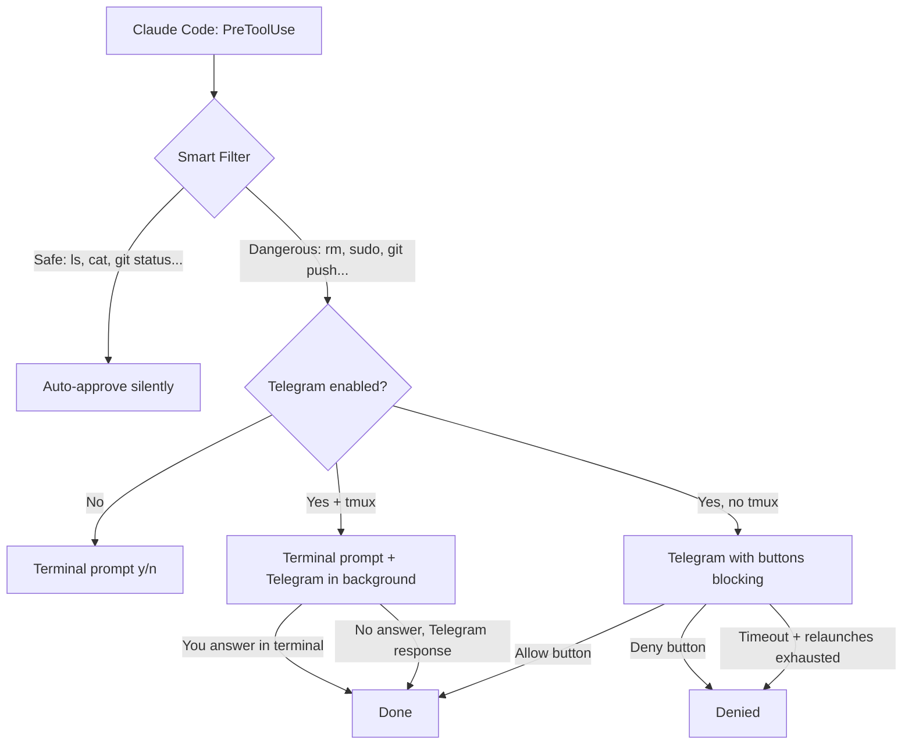

[](LICENSE)
[](#)
[](https://core.telegram.org/bots/api)
[](https://docs.anthropic.com/en/docs/claude-code)
[](#setup-in-3-minutes)

# claude-telegram-hook

**Let Claude Code keep working while you're away. Approve dangerous commands from your phone.**

> [English] | [Espanol](README_ES.md)

---

## The Problem

You're working with Claude Code. It's building a feature, running tests, writing files -- flowing. Then you need to step away. Coffee, a meeting, lunch, whatever. Claude keeps working... until it hits a command that needs your approval. And it stops. And waits. For minutes. For hours. Until you come back.

**claude-telegram-hook solves this.** One command to activate Telegram mode before you leave. Claude sends permission requests to your phone. You tap Allow from anywhere. Claude never stops.

```
You're at the PC:
  Claude works autonomously (safe commands run silently)
  Dangerous commands ask in terminal -> you type y

You need to step away:
  Type /telegram -> Telegram mode ON
  Claude keeps working
  Dangerous commands go to your phone -> tap Allow
  You approve from the couch, the cafe, the meeting

You're back:
  Type /telegram -> Telegram mode OFF
  Back to terminal prompts
```

## How It Works

**Safe commands run autonomously.** Reading files, `git status`, `ls`, `grep`, `npm test` -- all auto-approved silently. Claude flows without interruption. This is the key for a fluid experience: **you should enable autonomous execution of non-dangerous commands** in Claude Code's settings (the installer does this for you).

**Only dangerous commands ask for permission:** `rm`, `git push`, `sudo`, file deletions, credential changes. These are the ones that go to your terminal normally, or to Telegram when you've activated it.

### Without this hook

```
Claude reads 20 files...         -> "Allow Read?" [y/n]  (you type y)
Claude runs `git status`...      -> "Allow Bash?" [y/n]  (you type y)
Claude runs `ls -la`...          -> "Allow Bash?" [y/n]  (you type y)
Claude runs `npm test`...        -> "Allow Bash?" [y/n]  (you type y)

Every. Single. Operation. Asks. Claude stops constantly.
```

### With this hook (at the PC)

```
Claude reads 20 files...         -> auto-approved (silent)
Claude runs `git status`...      -> auto-approved (silent)
Claude runs `ls -la`...          -> auto-approved (silent)
Claude runs `npm test`...        -> auto-approved (silent)

Claude wants to run: git push    -> Terminal: "Allow? [y/n]"
                                    (only dangerous ops ask)
```

### With Telegram ON (away from PC)

```
Claude reads 20 files...         -> auto-approved (silent)
Claude runs `git status`...      -> auto-approved (silent)

Claude wants to run: git push
  Your phone buzzes:
  "Claude wants to run: git push"
  [ Allow ]  [ Deny ]
  Tap Allow from anywhere. Claude continues instantly.
```

**One simple command to toggle:**
- `/telegram` inside Claude Code -- interactive menu to turn ON/OFF
- Or use `telegram-on.sh` / `telegram-off.sh` from any terminal

---

## What You Need

| # | Requirement | Details |
|---|---|---|
| 1 | **A Telegram account** | The app you already have on your phone |
| 2 | **A Telegram bot token** | Created in 30 seconds via @BotFather -- free, instant |
| 3 | **Your Telegram user ID** | A number you grab once (we'll show you how) |
| 4 | **curl** | Already installed on macOS and virtually every Linux |
| 5 | **jq** | One command: `apt install jq` or `brew install jq` |

**That's the whole list.** No servers. No databases. No Docker. No paid APIs. Just a Bash script that talks to Telegram via `curl`.

---

## Setup in 3 Minutes

### Phase 1: Create Your Telegram Bot (30 seconds)

Open Telegram and search for **[@BotFather](https://t.me/BotFather)**.

**Step 1** -- Start a chat and send:

```
/newbot
```

**Step 2** -- Pick a name:

```
Claude Code Approver
```

**Step 3** -- Pick a username (must end in `bot`):

```
my_claude_approver_bot
```

**Step 4** -- BotFather gives you a token:

```
Use this token to access the HTTP API:
7012345678:AAH1bmFnZ2luZy1hLWJvdC10b2tlbi1oZXJl
```

> That's your **`TELEGRAM_BOT_TOKEN`**.

**Step 5** -- Get your user ID. Message **[@userinfobot](https://t.me/userinfobot)** on Telegram:

```
Your user ID: 123456789
```

> That number is your **`TELEGRAM_CHAT_ID`**.

**Step 6** -- Open a chat with **your new bot** and send `/start`. Required -- bots can't message you first.

---

### Phase 2: Install the Hook (60 seconds)

```bash
# Clone the repository
git clone https://github.com/webcomunicasolutions/claude-telegram-hook.git
cd claude-telegram-hook

# Copy the hook to Claude Code's hooks directory
mkdir -p ~/.claude/hooks
cp hook_permission_telegram.sh ~/.claude/hooks/
chmod +x ~/.claude/hooks/hook_permission_telegram.sh
```

Set your credentials in `~/.bashrc`, `~/.zshrc`, or `~/.profile`:

```bash
export TELEGRAM_BOT_TOKEN="7012345678:AAH1bmFnZ2luZy1hLWJvdC10b2tlbi1oZXJl"
export TELEGRAM_CHAT_ID="123456789"
```

Reload:

```bash
source ~/.bashrc  # or ~/.zshrc
```

---

### Phase 3: Configure Claude Code (30 seconds)

Open `~/.claude/settings.json` and add the hook:

```json
{
  "hooks": {
    "PreToolUse": [
      {
        "matcher": "",
        "hooks": [
          {
            "type": "command",
            "command": "bash ~/.claude/hooks/hook_permission_telegram.sh",
            "timeout": 600
          }
        ]
      }
    ]
  }
}
```

**Important settings** for proper operation:

```json
{
  "permissions": {
    "defaultMode": "default"
  }
}
```

> **About `PreToolUse`:** This hook fires before every tool use. The smart filter auto-approves safe commands (reads, `ls`, `git status`, etc.) so Claude works autonomously without interruption. For dangerous commands, the hook produces no output, which triggers Claude Code's normal terminal prompt.
>
> **About `defaultMode: "default"`:** This is essential. It means dangerous commands still require your approval in the terminal (or Telegram when enabled). The combination of the hook + this setting gives you the best of both worlds: **autonomous execution of safe commands + approval only for dangerous ones**.

**That's it.** Claude now works fluidly -- safe commands run silently, dangerous ones ask for your OK.

---

## How It Works



**Two simple modes:**

1. **Telegram OFF** (default) -- Safe ops auto-approved. Dangerous ops show Claude Code's normal terminal prompt. You type `y` or `n`.
2. **Telegram ON** -- Safe ops auto-approved. Dangerous ops go to Telegram with Allow/Deny buttons. You tap from your phone.

---

## Smart Filtering

Not every operation is equal. The smart filter classifies operations by risk and only asks when it matters.

### Sensitivity Modes

| Mode | Behavior | Use case |
|------|----------|----------|
| **`smart`** (default) | Auto-approves safe ops, asks for dangerous ones | Daily development |
| `critical` | Only the most destructive ops need approval | Experienced users |
| `all` | Everything needs approval (no auto-approve) | Maximum control |

```bash
export TELEGRAM_SENSITIVITY="smart"  # or "critical" or "all"
```

### What Gets Auto-Approved (smart mode)

| Category | Examples |
|----------|---------|
| File inspection | `ls`, `cat`, `head`, `tail`, `wc`, `file`, `stat` |
| Search | `grep`, `rg`, `find`, `which` |
| Git (read-only) | `git status`, `git log`, `git diff`, `git branch`, `git add`, `git commit` |
| Package info | `npm list`, `pip list`, `pip freeze` |
| System info | `ps`, `df`, `free`, `uname`, `whoami` |
| Data processing | `jq`, `sort`, `uniq`, `cut`, `awk` |
| File operations | `touch`, `mkdir`, `cp`, `mv`, `ln` |
| Network (read-only) | `curl`, `wget` |
| Safe tools | Read, Glob, Grep, WebFetch, WebSearch, Write/Edit (non-sensitive paths) |

### What Needs Approval

| Category | Examples |
|----------|---------|
| Destructive | `rm`, `rmdir`, `shred` |
| Privileged | `sudo`, `chmod`, `chown`, `kill` |
| System | `systemctl`, `reboot`, `mkfs`, `dd` |
| Git (write) | `git push`, `git reset`, `git rebase`, `git merge`, `git clean` |
| Packages | `apt install`, `npm install`, `pip install` |
| Docker | `docker rm`, `docker stop`, `docker prune` |
| Sensitive files | `.env`, `.ssh/*`, `credentials`, `/etc/*` |

### Compound Commands

Commands with `|`, `&&`, `||`, `;` are split and analyzed. If **any** part is dangerous, the whole chain needs approval:

```bash
git add . && git push    # -> dangerous (git push)
cat file.txt | grep foo  # -> safe (both safe)
ls -la && rm temp.txt    # -> dangerous (rm)
```

### Heredoc / Inline Script Analysis

Python and Node.js inline scripts are scanned for dangerous patterns like `os.remove`, `subprocess`, `shutil.rmtree`, `fs.unlinkSync`, etc.

---

## Toggling Telegram

Telegram is **OFF by default**. When off, dangerous operations simply show the normal terminal prompt.

### Using `/telegram` (recommended)

Inside Claude Code, type `/telegram`. It's a simple toggle:

- If OFF -> turns ON
- If ON -> turns OFF

### Using helper scripts

```bash
./telegram-on.sh     # Enable
./telegram-off.sh    # Disable
```

### Using the flag file directly

```bash
# Enable
touch /tmp/claude_telegram_active

# Disable
rm -f /tmp/claude_telegram_active

# Check status
[ -f /tmp/claude_telegram_active ] && echo "ON" || echo "OFF"
```

---

## Features

- **Smart filtering** -- Safe operations run autonomously. Only dangerous ones ask for permission.
- **Telegram toggle** -- Enable/disable Telegram anytime with `/telegram`, helper scripts, or a flag file.
- **Terminal-first** -- When Telegram is off, dangerous ops ask in the terminal like normal.
- **Phone-based approvals** -- When Telegram is on, tap Allow or Deny from anywhere.
- **Inline keyboard buttons** -- One tap. No typing.
- **Rich context** -- See the exact command, file path, or URL before you decide.
- **Smart reminders** -- Phone buzzes at 60s, 120s, and 60s before timeout if you haven't responded.
- **Relaunch on expiry** -- Missed the window? A Relaunch button appears so you can get the request again (up to 2 times).
- **Timeout protection** -- No response after relaunches? Auto-denied. Claude Code never hangs.
- **Bilingual fallback** -- Type "yes", "no", "si", "dale", "cancel" and more, in English or Spanish.
- **Security validation** -- Only responses from your authorized Chat ID are accepted.
- **Configurable fallback** -- Choose whether errors result in allow or deny.
- **Structured logging** -- Every decision is logged for debugging.
- **Zero infrastructure** -- No servers, no databases, no Docker, no cloud.
- **Single file** -- One Bash script. That's the entire hook.
- **Free forever** -- Telegram's Bot API costs nothing.

---

## Known Limitation: Multi-Agent Teams

> **Important:** If you use Claude Code's **Agent Teams** (multi-agent with `Task` and `TeamCreate`), **subagent permission requests do NOT trigger `PreToolUse` hooks**. They appear as standard terminal prompts in the parent session.
>
> **Workaround:** Pre-approve common commands in your `settings.json`:
>
> ```json
> {
>   "permissions": {
>     "allow": [
>       "Bash(export:*)",
>       "Bash(source:*)",
>       "Bash(curl:*)",
>       "Bash(npm:*)",
>       "Bash(node:*)"
>     ]
>   }
> }
> ```

---

## Configuration

All settings are environment variables with sensible defaults:

| Variable | Required | Default | Description |
|---|---|---|---|
| `TELEGRAM_BOT_TOKEN` | Yes | -- | Bot token from @BotFather |
| `TELEGRAM_CHAT_ID` | Yes | -- | Your Telegram user ID (numeric) |
| `TELEGRAM_SENSITIVITY` | No | `smart` | Filtering mode: `all`, `smart`, or `critical` |
| `TELEGRAM_PERMISSION_TIMEOUT` | No | `300` | Seconds to wait for Telegram response |
| `TELEGRAM_MAX_RETRIES` | No | `2` | Relaunch attempts after Telegram timeout |
| `TELEGRAM_FALLBACK_ON_ERROR` | No | `allow` | What happens if the hook errors: `allow` or `deny` |
| `TELEGRAM_HOOK_LOG` | No | `/tmp/claude/telegram_claude_hook.log` | Log file path (empty = disable) |

### Example: Smart filtering (default)

```bash
export TELEGRAM_BOT_TOKEN="7012345678:AAH..."
export TELEGRAM_CHAT_ID="123456789"
export TELEGRAM_SENSITIVITY="smart"
# Telegram OFF by default. Use /telegram to enable when needed.
```

### Example: Maximum control

```bash
export TELEGRAM_SENSITIVITY="all"             # Everything needs approval
export TELEGRAM_PERMISSION_TIMEOUT="120"      # Shorter timeout
# Then enable Telegram: touch /tmp/claude_telegram_active
```

---

## Automated Installer

```bash
git clone https://github.com/webcomunicasolutions/claude-telegram-hook.git
cd claude-telegram-hook
./install.sh
```

The installer will:

1. Check that `curl` and `jq` are installed
2. Prompt for your bot token and chat ID
3. Ask your preferred sensitivity mode
4. Copy the hook to `~/.claude/hooks/`
5. Create `.env` file with your credentials
6. Create a wrapper script that loads the `.env`
7. Update your Claude Code `settings.json` (hook, permissions, sandbox)
8. Install the `/telegram` skill for easy ON/OFF toggling
9. Send a test message to Telegram
10. **Restart Claude Code** and you're ready to go!

---

## Troubleshooting

### I don't get any message on Telegram

1. **Did you enable Telegram?** It's OFF by default. Use `/telegram` or `touch /tmp/claude_telegram_active`.
2. **Did you send `/start` to your bot?** Bots can't message you until you initiate.
3. **Is your token correct?**
   ```bash
   curl -s "https://api.telegram.org/bot${TELEGRAM_BOT_TOKEN}/getMe" | jq .
   ```
4. **Is your Chat ID correct?**
   ```bash
   curl -s "https://api.telegram.org/bot${TELEGRAM_BOT_TOKEN}/getUpdates" | jq '.result[-1].message.chat.id'
   ```

### Claude Code ignores the hook

- Verify `settings.json` has the hook under `PreToolUse` (not `PermissionRequest`).
- Ensure `"defaultMode": "default"` in your permissions settings.
- Check the script is executable: `ls -la ~/.claude/hooks/hook_permission_telegram.sh`.
- Restart Claude Code after editing `settings.json`.

### Everything gets auto-approved (no terminal prompt)

- Make sure `"defaultMode": "default"` is set (not `"acceptEdits"`).
- Check that dangerous commands are NOT in your permissions allow list.

### Buttons appear but nothing happens when I tap

- Tap buttons on the **most recent** message. Old messages have expired sessions.
- Verify your Chat ID matches.
- Make sure `"timeout": 600` is set in the hook config in `settings.json`. Without it, Claude Code kills the hook before you can respond.

### "jq: command not found"

```bash
# Debian / Ubuntu / WSL
sudo apt-get install -y jq

# macOS
brew install jq
```

### Checking the logs

```bash
tail -f /tmp/claude/telegram_claude_hook.log
```

---

## FAQ

**Q: Is Telegram required?**
A: No. Telegram is OFF by default. Without Telegram, the hook still provides smart filtering: safe operations are auto-approved and dangerous ones show a normal terminal prompt. Telegram is only for when you want to approve from your phone.

**Q: Is my bot token safe?**
A: The hook only messages your Chat ID and only accepts responses from that ID. Still, treat it like any credential: keep it in environment variables, never commit to git. Revoke in @BotFather if compromised.

**Q: Will this slow Claude Code down?**
A: No. Safe operations are auto-approved instantly (no network call). Dangerous operations only add the time it takes you to respond -- same as without the hook, but now you can respond from your phone.

**Q: Can I approve from multiple devices?**
A: Yes. Telegram delivers to all your devices. Tap Allow from whichever you see first.

**Q: Does this work on Windows (WSL)?**
A: Yes. Claude Code runs in WSL, which has `curl` and `jq`. Works identically.

**Q: Can I auto-approve specific tools?**
A: Yes. The smart filter auto-approves Read, Glob, Grep, WebFetch, WebSearch, and many Bash commands by default. You can also use Claude Code's built-in permissions allow list for additional control.

**Q: What's the difference between `smart` and `critical`?**
A: `smart` = everything safe unless explicitly dangerous (conservative). `critical` = everything safe unless explicitly very dangerous (permissive).

**Q: Does this work with multi-agent teams?**
A: The main session works fine. Subagent permissions bypass hooks -- see [Known Limitation](#known-limitation-multi-agent-teams).

---

## Bonus: Use It Beyond Claude Code

The Telegram approval pattern is not limited to Claude Code. We ship a **standalone Bash library** (`telegram_approve.sh`) you can `source` from any script.

### Quick Start

```bash
source telegram_approve.sh

# Yes/No question (returns exit code 0 or 1)
if telegram_ask "<b>Upload backup?</b>" "Upload" "Skip"; then
    echo "Approved"
fi

# Multiple choice (returns chosen callback_data on stdout)
choice=$(telegram_choose "Disk at 92%. What to do?" \
    "Clean logs" "clean" \
    "Restart" "restart" \
    "Ignore" "skip")

# Simple notification (no buttons)
telegram_send "<b>Cron job finished</b> -- 0 errors"
```

### Available Functions

| Function | What it does | Returns |
|---|---|---|
| `telegram_ask "text" ["Yes"] ["No"]` | Yes/No with buttons | Exit code: 0=yes, 1=no |
| `telegram_choose "text" "Btn" "data" ...` | Multiple choice buttons | stdout: chosen `callback_data` |
| `telegram_send "text"` | Plain notification | -- |
| `telegram_send_buttons "text" "B1" "d1" "B2" "d2"` | Custom 2-button message | -- |

### Examples

See the [`examples/`](examples/) directory:

| Script | What it does |
|---|---|
| [`backup_with_approval.sh`](examples/backup_with_approval.sh) | Creates a backup, asks before uploading |
| [`deploy_with_approval.sh`](examples/deploy_with_approval.sh) | Shows git info, asks before deploying |
| [`server_maintenance.sh`](examples/server_maintenance.sh) | Disk alert with multiple action choices |
| [`cron_notification.sh`](examples/cron_notification.sh) | Simple notification after a cron job |

---

## Contributing

Contributions are welcome. This project prizes simplicity -- a PR that adds a server or a `package.json` will be politely declined.

```bash
# Test by piping JSON to the hook
echo '{"tool_name":"Bash","tool_input":{"command":"ls -la"}}' \
  | bash hook_permission_telegram.sh
```

Please read [CONTRIBUTING.md](CONTRIBUTING.md) for details.

---

## License

[MIT](LICENSE) -- Use it however you want.

---

## Built With

| | |
|---|---|
| [Bash](https://www.gnu.org/software/bash/) | The hook script itself |
| [Telegram Bot API](https://core.telegram.org/bots/api) | Free messaging infrastructure |
| [Claude Code](https://docs.anthropic.com/en/docs/claude-code) | Anthropic's CLI -- the permission system we extend |
| [curl](https://curl.se/) | HTTP requests to Telegram |
| [jq](https://jqlang.github.io/jq/) | JSON parsing |

---

<p align="center">
<b>Safe ops run free. Dangerous ops ask nicely.</b>
<br><br>
<a href="https://github.com/webcomunicasolutions/claude-telegram-hook">github.com/webcomunicasolutions/claude-telegram-hook</a>
</p>
