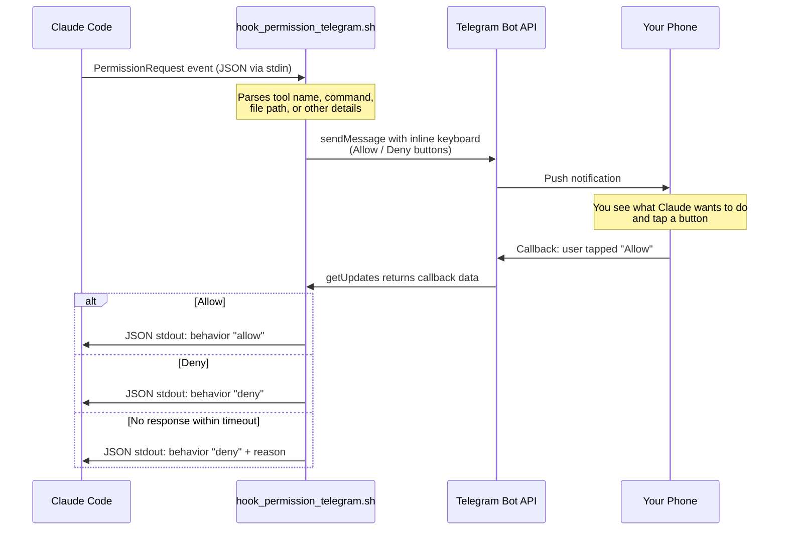

[](LICENSE)
[](#)
[](https://core.telegram.org/bots/api)
[](https://docs.anthropic.com/en/docs/claude-code)
[](#setup-in-3-minutes)

# claude-telegram-hook

**Control Claude Code from your phone. Walk away from the terminal.**

> [English] | [Espanol](README_ES.md)

---

## Why?

Claude Code is incredible -- until it asks for permission. Every shell command, every file write, every tool call pauses and waits for you to type `y` in the terminal. You're stuck staring at a blinking cursor while your coffee gets cold.

**claude-telegram-hook fixes that.** Permission requests go to your phone. You tap a button. Claude keeps working. You keep living.

### Before

```
You: Refactor the auth module and run the tests.

Claude: I need to run `npm test`. Allow? [y/n]
You: *watching terminal* ... y

Claude: I need to write src/auth.ts. Allow? [y/n]
You: *still watching* ... y

Claude: I need to run `git diff`. Allow? [y/n]
You: *20 minutes later, still here* ... y
```

### After

```
You: Refactor the auth module and run the tests.

*You walk away. Make coffee. Pet the dog.*

Phone buzzes:
  "Claude wants to run: npm test"
  [ Allow ]  [ Deny ]
*Tap Allow from the couch.*

Phone buzzes:
  "Claude wants to write: src/auth.ts"
  [ Allow ]  [ Deny ]
*Tap Allow while sipping coffee.*
```

Claude Code keeps working. You keep living.

---

## What You Need

That's the beauty of this project: almost nothing.

| # | Requirement | Details |
|---|---|---|
| 1 | **A Telegram account** | The app you already have on your phone |
| 2 | **A Telegram bot token** | Created in 30 seconds via @BotFather -- free, instant, no approval |
| 3 | **Your Telegram user ID** | A number you grab once (we'll show you how) |
| 4 | **curl** | Already installed on macOS and virtually every Linux |
| 5 | **jq** | One command to install: `apt install jq` or `brew install jq` |

**That's the whole list.** No servers to run. No databases. No Docker. No cloud accounts. No paid API keys. Telegram's Bot API is free with zero meaningful rate limits for this use case.

The entire hook is **a single Bash script** that talks to Telegram using `curl`. That's it.

---

## Setup in 3 Minutes

### Phase 1: Create Your Telegram Bot (30 seconds)

Open Telegram on your phone or desktop and search for **[@BotFather](https://t.me/BotFather)** -- Telegram's official tool for creating bots.

**Step 1** -- Start a chat with BotFather and send:

```
/newbot
```

**Step 2** -- BotFather replies: *"Alright, a new bot. How are we going to call it? Please choose a name for your bot."*

Type a friendly name:

```
Claude Code Approver
```

**Step 3** -- BotFather replies: *"Good. Now let's choose a username for your bot. It must end in `bot`."*

Pick a unique username:

```
my_claude_approver_bot
```

**Step 4** -- BotFather responds with your token:

```
Done! Congratulations on your new bot. You can now add a description,
about section and profile picture for your bot.

Use this token to access the HTTP API:
7012345678:AAH1bmFnZ2luZy1hLWJvdC10b2tlbi1oZXJl

Keep your token secure and store it safely, it can be used by anyone
to control your bot.
```

> Copy that long string. That is your **`TELEGRAM_BOT_TOKEN`**.

**Step 5** -- Now get your user ID. Search for **[@userinfobot](https://t.me/userinfobot)** on Telegram and send it any message. It replies instantly:

```
Your user ID: 123456789
```

> That number is your **`TELEGRAM_CHAT_ID`**.

**Step 6** -- One last thing: open a chat with **your new bot** and send `/start`. This is required -- bots cannot message you until you initiate contact.

Done. You now have the only two credentials you need.

---

### Phase 2: Install the Hook (60 seconds)

```bash
# Clone the repository
git clone https://github.com/webcomunicasolutions/claude-telegram-hook.git
cd claude-telegram-hook

# Copy the hook to Claude Code's hooks directory
mkdir -p ~/.claude/hooks
cp hook_permission_telegram.sh ~/.claude/hooks/
chmod +x ~/.claude/hooks/hook_permission_telegram.sh
```

Now set your credentials. Add these two lines to your `~/.bashrc`, `~/.zshrc`, or `~/.profile`:

```bash
export TELEGRAM_BOT_TOKEN="7012345678:AAH1bmFnZ2luZy1hLWJvdC10b2tlbi1oZXJl"
export TELEGRAM_CHAT_ID="123456789"
```

Reload your shell:

```bash
source ~/.bashrc  # or ~/.zshrc
```

---

### Phase 3: Configure Claude Code (30 seconds)

Open (or create) `~/.claude/settings.json` and add the hook:

```json
{
  "hooks": {
    "PermissionRequest": [
      {
        "matcher": "",
        "hooks": [
          {
            "type": "command",
            "command": "bash ~/.claude/hooks/hook_permission_telegram.sh",
            "timeout": 130
          }
        ]
      }
    ]
  }
}
```

> **Tip:** The `"matcher": ""` means the hook triggers for all permission requests. You can set it to `"Bash"` to only get Telegram prompts for shell commands, for example.
>
> **About PermissionRequest:** This hook uses the `PermissionRequest` event, which fires only when Claude Code would show you a permission dialog. This means it won't bother you for tools that are already auto-approved in your permissions.

**That's it. You're done.** Start Claude Code and ask it to do something that needs permission. Your phone will buzz.

---

## How It Works



The entire flow uses Telegram's free Bot API over HTTPS. No webhook server, no open ports, no background processes. The hook script:

1. **Receives** tool call details from Claude Code via stdin as JSON.
2. **Formats** a clear message showing the tool name, command, file path, or other relevant context.
3. **Sends** the message to your Telegram with inline Allow/Deny buttons.
4. **Polls** the Telegram API for your response using long polling.
5. **Returns** the appropriate exit code so Claude Code knows whether to proceed or stop.

---

## Features

- **Phone-based approvals** -- Tap Allow or Deny from anywhere. No terminal needed.
- **Inline keyboard buttons** -- One tap. No typing.
- **Rich context** -- See the exact command, file path, or URL before you decide.
- **Tool-aware formatting** -- Bash commands, file writes, edits, web fetches, and searches are each formatted to highlight the most important details.
- **Timeout protection** -- No response within the timeout? Action is auto-denied. Claude Code never hangs.
- **Bilingual text fallback** -- Besides buttons, you can type "yes", "no", "si", "dale", "cancel" and more, in English or Spanish.
- **Security validation** -- Only responses from your authorized Chat ID are accepted.
- **Configurable fallback** -- Choose whether errors (network issues, missing tools) result in allow or deny.
- **Structured logging** -- Every decision is logged for debugging and auditing.
- **Zero infrastructure** -- No servers, no databases, no Docker, no cloud.
- **Single file** -- One Bash script. That's the entire hook.
- **Free forever** -- Telegram's Bot API costs nothing.

---

## Configuration

All settings are environment variables with sensible defaults:

| Variable | Required | Default | Description |
|---|---|---|---|
| `TELEGRAM_BOT_TOKEN` | Yes | -- | Bot token from @BotFather |
| `TELEGRAM_CHAT_ID` | Yes | -- | Your Telegram user ID (numeric) |
| `TELEGRAM_PERMISSION_TIMEOUT` | No | `120` | Seconds to wait for a response before auto-denying |
| `TELEGRAM_FALLBACK_ON_ERROR` | No | `allow` | What happens if the hook errors out: `allow` or `deny` |
| `TELEGRAM_HOOK_LOG` | No | `/tmp/telegram_claude_hook.log` | Log file path. Set to empty string to disable |

### Example: Longer timeout and strict fallback

```bash
export TELEGRAM_BOT_TOKEN="7012345678:AAH1bmFnZ2luZy1hLWJvdC10b2tlbi1oZXJl"
export TELEGRAM_CHAT_ID="123456789"
export TELEGRAM_PERMISSION_TIMEOUT="300"
export TELEGRAM_FALLBACK_ON_ERROR="deny"
export TELEGRAM_HOOK_LOG="$HOME/.claude/logs/telegram_hook.log"
```

---

## Automated Installer

Don't want to do the steps manually? Use the included installer:

```bash
# Option 1: Run directly from the repo
git clone https://github.com/webcomunicasolutions/claude-telegram-hook.git
cd claude-telegram-hook
./install.sh

# Option 2: One-liner
curl -fsSL https://raw.githubusercontent.com/webcomunicasolutions/claude-telegram-hook/main/install.sh | bash
```

The installer will:

- Check that `curl` and `jq` are installed
- Prompt you for your bot token and chat ID
- Copy the hook script to `~/.claude/hooks/`
- Add environment variables to your shell profile
- Update your Claude Code `settings.json`
- Send a test message to your Telegram to confirm everything works

---

## Troubleshooting

### I don't get any message on Telegram

1. **Did you send `/start` to your bot?** Bots can't message you until you initiate. Open a chat with your bot and send `/start`.
2. **Is your token correct?** Test it:
   ```bash
   curl -s "https://api.telegram.org/bot${TELEGRAM_BOT_TOKEN}/getMe" | jq .
   ```
   You should see your bot's info. If you get `"ok": false`, the token is wrong.
3. **Is your Chat ID correct?** Send a message to your bot, then run:
   ```bash
   curl -s "https://api.telegram.org/bot${TELEGRAM_BOT_TOKEN}/getUpdates" | jq '.result[-1].message.chat.id'
   ```
   The returned number must match your `TELEGRAM_CHAT_ID`.

### Claude Code ignores the hook

- Verify your `settings.json` is valid JSON (no trailing commas, proper nesting).
- Make sure the hook is under `PermissionRequest` in your `settings.json`.
- Check the script is executable: `ls -la ~/.claude/hooks/hook_permission_telegram.sh`.
- Restart Claude Code after editing `settings.json`.

### The hook times out before I can respond

Increase the timeout:

```bash
export TELEGRAM_PERMISSION_TIMEOUT=300  # 5 minutes
```

Also update the `timeout` value in `settings.json` to be slightly higher (e.g., `310`).

### Buttons appear but nothing happens when I tap

- Make sure you're tapping buttons on the **most recent** message. Old messages have expired polling sessions.
- Verify your Chat ID matches -- the hook ignores callbacks from unauthorized users.

### "jq: command not found"

```bash
# Debian / Ubuntu / WSL
sudo apt-get install -y jq

# macOS
brew install jq
```

### Claude Code's sandbox blocks the request

Add `api.telegram.org` to the allowed network domains in `settings.json`:

```json
{
  "network": {
    "allowedDomains": ["api.telegram.org"]
  }
}
```

### Checking the logs

The hook writes detailed logs by default:

```bash
tail -f /tmp/telegram_claude_hook.log
```

---

## FAQ

**Q: Is my bot token safe?**
A: Your bot token lets someone send messages *as* your bot, but the hook only ever messages your own Chat ID and only accepts responses from that same ID. Still, treat it like any credential: keep it in environment variables, never commit it to git. If compromised, revoke it instantly in @BotFather with `/revokenewtoken`.

**Q: What if I lose internet on my phone?**
A: The hook times out after `TELEGRAM_PERMISSION_TIMEOUT` seconds and auto-denies the action. Claude Code won't hang. You can also respond from Telegram Desktop, Telegram Web, or any device where you're logged in.

**Q: Will this slow Claude Code down?**
A: The hook adds exactly the time it takes you to tap a button. Claude Code already pauses on permission requests -- this just moves the pause from your terminal to your phone.

**Q: Can I approve from multiple devices?**
A: Yes. Telegram delivers to all your logged-in devices. Tap Allow from whichever you see first -- phone, tablet, desktop app, or web client.

**Q: Can I use a Telegram group instead of a direct message?**
A: Yes. Use the group's chat ID as `TELEGRAM_CHAT_ID` and make sure the bot is a member with permission to send messages.

**Q: Does this work on Windows (WSL)?**
A: Yes. Claude Code runs in WSL, which has `curl` and supports `jq`. The hook works identically.

**Q: What about Telegram rate limits?**
A: Telegram allows roughly 30 messages per second per bot. For a single developer approving Claude Code actions, you'll never come close.

**Q: Can I auto-approve certain tools?**
A: Yes. Change the `"matcher"` in your `settings.json` to only match tools you want Telegram approval for (e.g., `"Bash"` for shell commands only). Read-only tools like `Read`, `Glob`, and `Grep` can be left to the default terminal flow or auto-approved in Claude Code's permissions.

**Q: Can I customize the message format?**
A: Absolutely. The message template lives inside the hook script. Edit it to change the layout, add timestamps, include session IDs, or anything else you want.

**Q: Does this work with Claude Code teams or shared sessions?**
A: Each person sets up their own bot and chat ID. The hook runs locally on whoever launched Claude Code.

---

## Contributing

Contributions are welcome. This project prizes simplicity above everything -- a PR that adds a server, a database, or a `package.json` will be politely declined.

Great contributions:

- Bug fixes
- Better message formatting
- New language support for text responses
- Documentation improvements
- Translations (see [README_ES.md](README_ES.md))

```bash
# Fork, clone, branch
git checkout -b my-improvement

# Test manually by piping JSON to the hook
echo '{"tool_name":"Bash","tool_input":{"command":"ls -la"},"session_id":"test"}' \
  | bash hook_permission_telegram.sh

# Commit and open a PR
git commit -m "Describe what you improved"
git push origin my-improvement
```

Please read [CONTRIBUTING.md](CONTRIBUTING.md) for details.

---

## License

[MIT](LICENSE) -- Use it however you want.

---

## Built With

| | |
|---|---|
| [Bash](https://www.gnu.org/software/bash/) | The hook script itself |
| [Telegram Bot API](https://core.telegram.org/bots/api) | Free messaging infrastructure |
| [Claude Code](https://docs.anthropic.com/en/docs/claude-code) | Anthropic's CLI -- the permission system we extend |
| [curl](https://curl.se/) | HTTP requests to Telegram |
| [jq](https://jqlang.github.io/jq/) | JSON parsing |

---

<p align="center">
<b>Stop watching the terminal. Start living.</b>
<br><br>
<a href="https://github.com/webcomunicasolutions/claude-telegram-hook">github.com/webcomunicasolutions/claude-telegram-hook</a>
</p>
