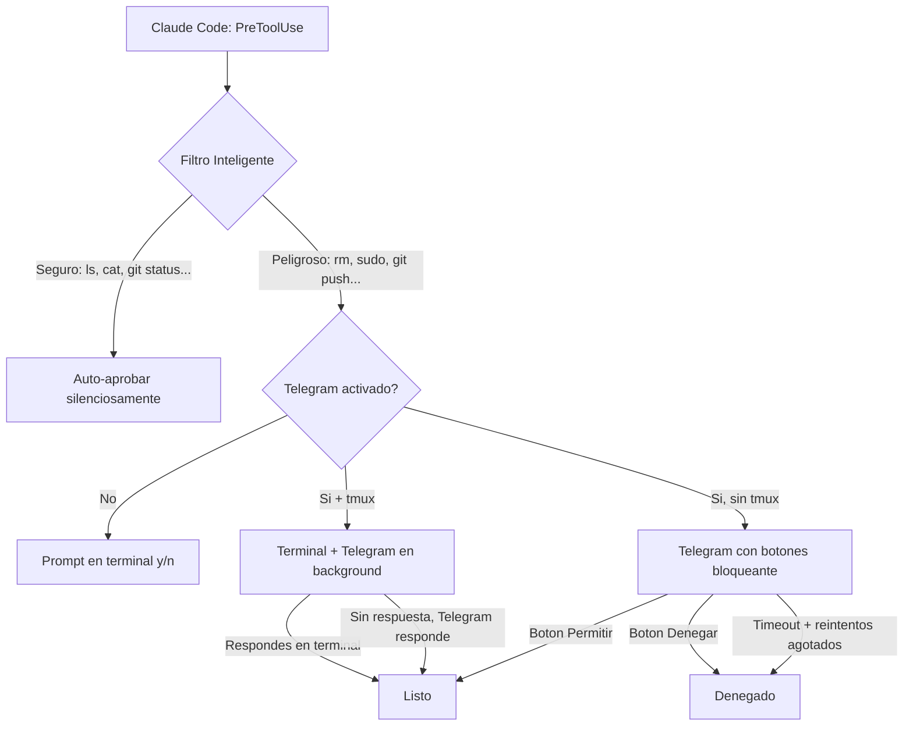

[](https://opensource.org/licenses/MIT)
[](#)
[](https://core.telegram.org/bots/api)
[](https://docs.anthropic.com/en/docs/claude-code)
[](#-configura-en-3-minutos)

# claude-telegram-hook

**Permisos inteligentes para Claude Code. Aprueba desde la terminal o desde el movil.**

---

[English](README.md) | **Espanol**

---

## Por que?

Claude Code es increible, hasta que pide permiso. Cada comando, cada escritura de archivo, una pausa para escribir `y`. Pero no todas las operaciones merecen una pregunta. `ls -la` no es `rm -rf /`.

**claude-telegram-hook arregla eso.** Las operaciones seguras se ejecutan solas. Las peligrosas te preguntan: en la terminal si estas en el PC, o por Telegram si te has ido.

### Antes (sin este hook)

```
Claude lee 20 archivos...         -> "Allow Read?" [y/n]  (escribes y)
Claude ejecuta `git status`...    -> "Allow Bash?" [y/n]  (escribes y)
Claude ejecuta `ls -la`...        -> "Allow Bash?" [y/n]  (escribes y)
Claude ejecuta `npm test`...      -> "Allow Bash?" [y/n]  (escribes y)

Todas. Las. Operaciones. Preguntan.
```

### Despues (con filtro inteligente)

```
Claude lee 20 archivos...         -> auto-aprobado (silencioso)
Claude ejecuta `git status`...    -> auto-aprobado (silencioso)
Claude ejecuta `ls -la`...        -> auto-aprobado (silencioso)
Claude ejecuta `npm test`...      -> auto-aprobado (silencioso)

Claude quiere ejecutar: git push  -> Terminal: "Allow? [y/n]"
                                     (escribes y -- solo para ops peligrosas)
```

### Despues (con Telegram activado)

```
Claude lee 20 archivos...         -> auto-aprobado (silencioso)
Claude ejecuta `git status`...    -> auto-aprobado (silencioso)

Claude quiere ejecutar: git push
  El movil vibra:
  "Claude quiere ejecutar: git push"
  [ Permitir ]  [ Denegar ]
  *Toque en Permitir desde el sofa*
```

**Dos modos. Tu eliges:**
- **Telegram OFF** (por defecto): Ops seguras auto-aprobadas, peligrosas preguntan en terminal
- **Telegram ON**: Ops seguras auto-aprobadas, peligrosas van a Telegram con botones

Cambia cuando quieras con `/telegram` dentro de Claude Code, o `telegram-on.sh` / `telegram-off.sh`.

---

## Que necesitas

| Requisito | Ya lo tienes? |
|-----------|:------------:|
| Una cuenta de Telegram | Probablemente si |
| `curl` instalado | Viene con tu sistema |
| `jq` instalado | `sudo apt install jq` |
| Claude Code instalado | Si lees esto, si |

**Eso es todo.** No hay servidores que montar. No hay bases de datos. No hay Docker. Solo un script de Bash que habla con la API gratuita de Telegram.

---

## Configura en 3 Minutos

### Fase 1: Crea tu bot de Telegram

Abre Telegram y busca **@BotFather**:

> **Tu:** `/newbot`
>
> **BotFather:** *"How are we going to call it?"*
>
> **Tu:** `Mi Claude Hook`
>
> **BotFather:** *"Now let's choose a username."*
>
> **Tu:** `mi_claude_hook_bot`
>
> **BotFather:** Te da un token:
> ```
> 7123456789:AAHxxxxxxxxxxxxxxxxxxxxxxxxxxxxxxxx
> ```

**Guarda ese token.** Es tu `TELEGRAM_BOT_TOKEN`.

Tu **Chat ID**: escribele a **@userinfobot** en Telegram y te lo dice al instante.

Abre un chat con **tu bot nuevo** y envia `/start`.

---

### Fase 2: Instala el hook

```bash
git clone https://github.com/webcomunicasolutions/claude-telegram-hook.git
cd claude-telegram-hook

mkdir -p ~/.claude/hooks
cp hook_permission_telegram.sh ~/.claude/hooks/
chmod +x ~/.claude/hooks/hook_permission_telegram.sh

# Configura tus credenciales
echo 'export TELEGRAM_BOT_TOKEN="tu-token-aqui"' >> ~/.bashrc
echo 'export TELEGRAM_CHAT_ID="tu-chat-id-aqui"' >> ~/.bashrc
source ~/.bashrc
```

---

### Fase 3: Configura Claude Code

Agrega el hook en tu `~/.claude/settings.json`:

```json
{
  "hooks": {
    "PreToolUse": [
      {
        "matcher": "",
        "hooks": [
          {
            "type": "command",
            "command": "bash ~/.claude/hooks/hook_permission_telegram.sh",
            "timeout": 600
          }
        ]
      }
    ]
  }
}
```

**Configuracion importante** para que funcione correctamente:

```json
{
  "permissions": {
    "defaultMode": "default"
  }
}
```

> **Sobre `PreToolUse`:** El hook se ejecuta antes de cada herramienta. El filtro inteligente auto-aprueba las operaciones seguras. Para las peligrosas, no produce salida, lo que hace que Claude Code muestre su prompt normal de terminal (`y/n`).
>
> **Sobre `defaultMode: "default"`:** Necesario para que aparezca el prompt de terminal en operaciones peligrosas.

**Listo.** Las operaciones seguras ahora se auto-aprueban. Las peligrosas preguntan en la terminal.

---

## Como funciona



**Dos modos simples:**

1. **Telegram OFF** (por defecto) -- Ops seguras auto-aprobadas. Ops peligrosas muestran el prompt normal de terminal.
2. **Telegram ON** -- Ops seguras auto-aprobadas. Ops peligrosas van a Telegram con botones Permitir/Denegar.

---

## Filtro Inteligente

No todas las operaciones son iguales. El filtro clasifica por riesgo y solo pregunta cuando importa.

### Modos de Sensibilidad

| Modo | Comportamiento | Caso de uso |
|------|---------------|-------------|
| **`smart`** (defecto) | Auto-aprueba ops seguras, pregunta por peligrosas | Desarrollo diario |
| `critical` | Solo las mas destructivas necesitan aprobacion | Usuarios expertos |
| `all` | Todo necesita aprobacion (sin auto-aprobar) | Control maximo |

```bash
export TELEGRAM_SENSITIVITY="smart"  # o "critical" o "all"
```

### Que se Auto-Aprueba (modo smart)

| Categoria | Ejemplos |
|-----------|---------|
| Inspeccion de archivos | `ls`, `cat`, `head`, `tail`, `wc`, `file`, `stat` |
| Busqueda | `grep`, `rg`, `find`, `which` |
| Git (solo lectura) | `git status`, `git log`, `git diff`, `git branch`, `git add`, `git commit` |
| Info de paquetes | `npm list`, `pip list`, `pip freeze` |
| Info del sistema | `ps`, `df`, `free`, `uname`, `whoami` |
| Procesamiento de datos | `jq`, `sort`, `uniq`, `cut`, `awk` |
| Operaciones de archivos | `touch`, `mkdir`, `cp`, `mv`, `ln` |
| Red (solo lectura) | `curl`, `wget` |
| Herramientas seguras | Read, Glob, Grep, WebFetch, WebSearch, Write/Edit (rutas no sensibles) |

### Que Necesita Aprobacion

| Categoria | Ejemplos |
|-----------|---------|
| Destructivo | `rm`, `rmdir`, `shred` |
| Privilegiado | `sudo`, `chmod`, `chown`, `kill` |
| Sistema | `systemctl`, `reboot`, `mkfs`, `dd` |
| Git (escritura) | `git push`, `git reset`, `git rebase`, `git merge`, `git clean` |
| Paquetes | `apt install`, `npm install`, `pip install` |
| Docker | `docker rm`, `docker stop`, `docker prune` |
| Archivos sensibles | `.env`, `.ssh/*`, `credentials`, `/etc/*` |

### Comandos Compuestos

Los comandos con `|`, `&&`, `||`, `;` se dividen y analizan. Si **cualquier** parte es peligrosa, toda la cadena necesita aprobacion:

```bash
git add . && git push    # -> peligroso (git push)
cat file.txt | grep foo  # -> seguro (ambos seguros)
ls -la && rm temp.txt    # -> peligroso (rm)
```

### Analisis de Heredoc / Script Inline

Los scripts inline de Python y Node.js se escanean buscando patrones peligrosos como `os.remove`, `subprocess`, `shutil.rmtree`, `fs.unlinkSync`, etc.

---

## Activar/Desactivar Telegram

Telegram esta **OFF por defecto**. Cuando esta apagado, las operaciones peligrosas simplemente muestran el prompt normal de la terminal.

### Usando `/telegram` (recomendado)

Dentro de Claude Code, escribe `/telegram` para un menu interactivo:

- Si esta OFF: opciones para activar con 30s, 60s, o 120s de timeout
- Si esta ON: opciones para desactivar o cambiar configuracion

### Usando scripts auxiliares

```bash
# Activar Telegram
./telegram-on.sh          # default: 120s timeout
./telegram-on.sh 60       # timeout personalizado

# Desactivar Telegram
./telegram-off.sh
```

### Usando el archivo flag directamente

```bash
# Activar (numero = timeout de Telegram en segundos)
echo 120 > /tmp/claude_telegram_active

# Desactivar
rm -f /tmp/claude_telegram_active

# Ver estado
cat /tmp/claude_telegram_active 2>/dev/null && echo "ON" || echo "OFF"
```

---

## Caracteristicas

- **Filtro inteligente** -- Las operaciones seguras se ejecutan solas. Solo las peligrosas preguntan.
- **Toggle de Telegram** -- Activa/desactiva cuando quieras con `/telegram`, scripts, o flag file.
- **Terminal primero** -- Con Telegram apagado, las ops peligrosas preguntan en terminal como siempre.
- **Aprobacion por movil** -- Con Telegram activado, toca Permitir o Denegar desde cualquier sitio.
- **Botones interactivos** -- Un toque. Sin escribir nada.
- **Contexto completo** -- Ves el comando exacto antes de decidir.
- **Recordatorios inteligentes** -- El movil vuelve a vibrar si no has respondido.
- **Reintento tras timeout** -- Se te paso? Aparece un boton de Reintentar.
- **Proteccion por timeout** -- Sin respuesta tras reintentos? Se deniega automaticamente.
- **Respuesta bilingue** -- Escribe "si", "no", "dale", "cancel", "yes", "deny" y mas.
- **Validacion de seguridad** -- Solo se aceptan respuestas de tu Chat ID autorizado.
- **Sin infraestructura** -- Sin servidores, sin bases de datos, sin Docker.
- **Un solo archivo** -- Un script Bash. Eso es todo el hook.
- **Gratis siempre** -- La API de Telegram no cuesta nada.

---

## Limitacion conocida: Equipos Multi-Agente

> **Importante:** Las **solicitudes de permiso de subagentes no pasan por hooks `PreToolUse`**. Aparecen como dialogos de terminal en la sesion principal.
>
> **Solucion:** Pre-aprueba los comandos comunes en tu `settings.json`:
>
> ```json
> {
>   "permissions": {
>     "allow": [
>       "Bash(export:*)",
>       "Bash(source:*)",
>       "Bash(curl:*)",
>       "Bash(npm:*)",
>       "Bash(node:*)"
>     ]
>   }
> }
> ```

---

## Configuracion

| Variable de entorno | Requerida | Defecto | Descripcion |
|---------------------|:---------:|---------|-------------|
| `TELEGRAM_BOT_TOKEN` | Si | -- | Token del bot de @BotFather |
| `TELEGRAM_CHAT_ID` | Si | -- | Tu ID numerico de Telegram |
| `TELEGRAM_SENSITIVITY` | No | `smart` | Modo de filtrado: `all`, `smart`, o `critical` |
| `TELEGRAM_PERMISSION_TIMEOUT` | No | `300` | Segundos de espera en Telegram |
| `TELEGRAM_MAX_RETRIES` | No | `2` | Reintentos tras timeout de Telegram |
| `TELEGRAM_FALLBACK_ON_ERROR` | No | `allow` | Que hacer si el hook falla: `allow` o `deny` |
| `TELEGRAM_HOOK_LOG` | No | `/tmp/telegram_claude_hook.log` | Archivo de log (vacio = desactivar) |

---

## Instalador Automatico

```bash
git clone https://github.com/webcomunicasolutions/claude-telegram-hook.git
cd claude-telegram-hook
bash install.sh
```

El instalador te guia paso a paso:

1. Verifica que tengas `curl` y `jq`.
2. Te pide tu token de bot y chat ID.
3. Te pregunta el modo de sensibilidad preferido.
4. Copia el hook a `~/.claude/hooks/`.
5. Configura las variables de entorno.
6. Actualiza tu `settings.json`.
7. Envia un mensaje de prueba a Telegram.

---

## Solucion de problemas

### No me llegan mensajes a Telegram

1. **Activaste Telegram?** Esta OFF por defecto. Usa `/telegram` o `echo 120 > /tmp/claude_telegram_active`.
2. **Le enviaste `/start` al bot?** Los bots no pueden iniciar conversaciones.
3. **Verifica el token:**
   ```bash
   curl -s "https://api.telegram.org/bot${TELEGRAM_BOT_TOKEN}/getMe" | jq .
   ```
4. **Verifica el Chat ID:**
   ```bash
   curl -s "https://api.telegram.org/bot${TELEGRAM_BOT_TOKEN}/getUpdates" | jq '.result[-1].message.chat.id'
   ```

### Claude Code ignora el hook

- Verifica que el hook esta bajo `PreToolUse` en `settings.json` (no `PermissionRequest`).
- Asegurate de tener `"defaultMode": "default"` en permisos.
- Comprueba permisos de ejecucion: `chmod +x ~/.claude/hooks/hook_permission_telegram.sh`.
- Reinicia Claude Code despues de editar `settings.json`.

### Todo se auto-aprueba (no aparece prompt)

- Verifica `"defaultMode": "default"` (no `"acceptEdits"`).
- Comprueba que los comandos peligrosos NO estan en tu lista de permisos allow.

### Error "jq: command not found"

```bash
sudo apt-get install -y jq    # Ubuntu / Debian / WSL
brew install jq                # macOS
```

### Ver los logs

```bash
tail -f /tmp/telegram_claude_hook.log
```

---

## Preguntas frecuentes

<details>
<summary><strong>Telegram es obligatorio?</strong></summary>

No. Telegram esta OFF por defecto. Sin Telegram, el hook igual proporciona filtrado inteligente: operaciones seguras auto-aprobadas, peligrosas preguntan en terminal. Telegram es solo para cuando quieres aprobar desde el movil.
</details>

<details>
<summary><strong>Es seguro?</strong></summary>

Todo es local. El script se ejecuta en tu maquina y habla directamente con la API de Telegram via HTTPS. No hay intermediarios.
</details>

<details>
<summary><strong>Cuanto cuesta?</strong></summary>

Nada. La Bot API de Telegram es completamente gratuita.
</details>

<details>
<summary><strong>Funciona en macOS / Linux / WSL?</strong></summary>

Si. Funciona en cualquier sistema con Bash, `curl` y `jq`.
</details>

<details>
<summary><strong>Puedo aprobar desde el PC tambien?</strong></summary>

Si. Telegram funciona en movil, escritorio y web. Aprueba desde donde quieras.
</details>

<details>
<summary><strong>Que pasa si no respondo?</strong></summary>

Te llegan recordatorios. Si se agota el timeout, aparece un boton Reintentar. Si sigues sin responder tras todos los reintentos, se deniega automaticamente.
</details>

<details>
<summary><strong>Cual es la diferencia entre smart y critical?</strong></summary>

`smart` = todo seguro a menos que sea explicitamente peligroso (conservador). `critical` = todo seguro a menos que sea extremadamente peligroso (permisivo).
</details>

<details>
<summary><strong>Funciona con multi-agentes?</strong></summary>

La sesion principal si. Los subagentes no pasan por el hook. Ver la seccion de limitaciones.
</details>

---

## Bonus: Usalo mas alla de Claude Code

Incluimos una **libreria Bash independiente** (`telegram_approve.sh`) para cualquier script:

```bash
source telegram_approve.sh

if telegram_ask "<b>Subir backup?</b>" "Subir" "Saltar"; then
    echo "Aprobado"
fi

choice=$(telegram_choose "Disco al 92%. Que hacemos?" \
    "Limpiar logs" "clean" \
    "Reiniciar" "restart" \
    "Ignorar" "skip")

telegram_send "<b>Cron job terminado</b> -- 0 errores"
```

Ver el directorio [`examples/`](examples/) para scripts listos para usar.

---

## Contribuir

Las contribuciones son bienvenidas. Ver [CONTRIBUTING.md](CONTRIBUTING.md).

---

## Licencia

[MIT](LICENSE) -- Usalo como quieras.

---

## Construido con

- [Bash](https://www.gnu.org/software/bash/) - El lenguaje que ya tienes instalado
- [Telegram Bot API](https://core.telegram.org/bots/api) - Mensajeria gratuita con botones
- [Claude Code](https://docs.anthropic.com/en/docs/claude-code) - La CLI de Anthropic
- [curl](https://curl.se/) - Para hablar con Telegram
- [jq](https://jqlang.github.io/jq/) - Para procesar JSON

---

<div align="center">

**Las ops seguras vuelan libres. Las peligrosas piden permiso.**

**[Reportar Bug](https://github.com/webcomunicasolutions/claude-telegram-hook/issues)** | **[Solicitar Feature](https://github.com/webcomunicasolutions/claude-telegram-hook/issues)** | **[Ver en GitHub](https://github.com/webcomunicasolutions/claude-telegram-hook)**

</div>
