[](https://opensource.org/licenses/MIT)
[](#)
[](https://core.telegram.org/bots/api)
[](https://docs.anthropic.com/en/docs/claude-code)
[](#-configura-en-3-minutos)

# claude-telegram-hook

**Controla Claude Code desde tu movil. Levantate de la silla.**

Un hook de Bash para [Claude Code](https://docs.anthropic.com/en/docs/claude-code) que envia las solicitudes de permisos a Telegram en lugar de la terminal. Aprueba o rechaza con un toque desde tu telefono.

---

[English](README.md) | **Espanol**

---

## Por que?

Conoces la situacion: Claude Code esta trabajando, llega a un punto donde necesita tu permiso, y tu... no estas mirando la terminal. Tal vez fuiste por un cafe. Tal vez estas en otra pantalla. El caso es que Claude se queda esperando y tu ni te enteras.

**Eso se acabo.**

<table>
<tr>
<td width="50%" align="center">

### Antes

```
Terminal dice:
"Allow Bash(git push)? [Y/n]"

Tu: en la cocina, sin enterarte.
Claude: esperando... esperando...
          esperando...
```

*Minutos perdidos. Flow roto.*

</td>
<td width="50%" align="center">

### Despues

```
Tu telefono vibra:
"Claude quiere ejecutar: git push"
        [Permitir] [Denegar]

Tu: un toque y listo.
Claude: sigue trabajando.
```

*Productividad intacta. Desde cualquier sitio.*

</td>
</tr>
</table>

---

## Que necesitas

Antes de que pienses "seguro es complicado", mira esto:

| Requisito | Ya lo tienes? |
|-----------|:------------:|
| Una cuenta de Telegram | Probablemente si |
| `curl` instalado | Viene con tu sistema |
| `jq` instalado | `sudo apt install jq` |
| Claude Code instalado | Si lees esto, si |

**Eso es todo.** No hay servidores que montar. No hay bases de datos. No hay Docker. No hay nada que pagar. Solo un script de Bash que habla con la API gratuita de Telegram usando `curl`.

Dos credenciales y tres minutos. Vamos.

---

## Configura en 3 Minutos

### Fase 1: Crea tu bot de Telegram

Abrir Telegram y buscar **@BotFather**. Es el bot oficial de Telegram para crear bots. Toda la conversacion dura 30 segundos:

> **Tu:** `/start`
>
> **BotFather:** *Te da la bienvenida y muestra los comandos disponibles.*
>
> **Tu:** `/newbot`
>
> **BotFather:** *"Alright, a new bot. How are we going to call it? Please choose a name for your bot."*
>
> **Tu:** `Mi Claude Hook` *(o el nombre que quieras)*
>
> **BotFather:** *"Good. Now let's choose a username for your bot. It must end in 'bot'."*
>
> **Tu:** `mi_claude_hook_bot` *(tiene que terminar en "bot")*
>
> **BotFather:** *"Done! Congratulations on your new bot..."*
>
> Y te da algo como:
> ```
> Use this token to access the HTTP API:
> 7123456789:AAHxxxxxxxxxxxxxxxxxxxxxxxxxxxxxxxx
> ```

**Guarda ese token.** Es tu `TELEGRAM_BOT_TOKEN`.

Ahora necesitas tu **Chat ID**. Envia cualquier mensaje a tu bot nuevo y luego abre esto en tu navegador:

```
https://api.telegram.org/bot<TU_TOKEN>/getUpdates
```

En la respuesta JSON busca `"chat":{"id":123456789}`. Ese numero es tu `TELEGRAM_CHAT_ID`.

> **Truco rapido:** Tambien puedes escribirle a **@userinfobot** en Telegram y te dice tu ID al instante.

---

### Fase 2: Instala el hook

```bash
# Clona el repositorio
git clone https://github.com/webcomunicasolutions/claude-telegram-hook.git
cd claude-telegram-hook

# Copia el hook donde Claude Code pueda encontrarlo
mkdir -p ~/.claude/hooks
cp hook_permission_telegram.sh ~/.claude/hooks/
chmod +x ~/.claude/hooks/hook_permission_telegram.sh

# Configura tus credenciales
export TELEGRAM_BOT_TOKEN="7123456789:AAHxxxxxxxxxxxxxxxxxxxxxxxxxxxxxxxx"
export TELEGRAM_CHAT_ID="123456789"
```

Para que las variables persistan entre sesiones, agregalas a tu `~/.bashrc` o `~/.zshrc`:

```bash
echo 'export TELEGRAM_BOT_TOKEN="tu-token-aqui"' >> ~/.bashrc
echo 'export TELEGRAM_CHAT_ID="tu-chat-id-aqui"' >> ~/.bashrc
source ~/.bashrc
```

---

### Fase 3: Configura Claude Code

Agrega el hook en tu `~/.claude/settings.json`:

```json
{
  "hooks": {
    "PermissionRequest": [
      {
        "matcher": "",
        "hooks": [
          {
            "type": "command",
            "command": "bash ~/.claude/hooks/hook_permission_telegram.sh",
            "timeout": 600
          }
        ]
      }
    ]
  }
}
```

> **Nota:** Si ya tienes un `settings.json` con otros hooks, simplemente agrega la entrada `PermissionRequest`. El `matcher` vacio (`""`) significa que se activa para todas las solicitudes de permiso. Puedes cambiarlo a `"Bash"` si solo quieres interceptar comandos de terminal.
>
> **Sobre el timeout:** Los `600` segundos dan margen suficiente para el mecanismo de reintento (cada ronda son ~120s de espera + 60s para el boton de retry, hasta 2 reintentos por defecto). El timeout real por ronda se controla con `TELEGRAM_PERMISSION_TIMEOUT` (120s por defecto).
>
> **Sobre PermissionRequest:** Este hook usa el evento `PermissionRequest`, que solo se dispara cuando Claude Code te mostraria un dialogo de permiso. No te molestara con herramientas que ya estan auto-aprobadas en tu configuracion.

**Listo.** La proxima vez que Claude Code necesite permiso, te llegara un mensaje a Telegram.

---

## Como funciona

```mermaid
sequenceDiagram
    participant C as Claude Code
    participant H as Hook (Bash)
    participant T as Telegram Bot API
    participant U as Tu Telefono

    C->>H: Solicita permiso (PermissionRequest)
    H->>T: Envia mensaje con botones<br/>[Permitir] [Denegar]
    T->>U: Notificacion push

    alt Respondes a tiempo
        U->>T: Toque en [Permitir]
        T->>H: Callback con respuesta
        H->>C: JSON: behavior "allow"
        Note over C: Continua trabajando
    else No respondes (timeout)
        H->>U: ⏰ Recordatorios a los 60s y 90s
        H->>T: "Tiempo agotado" + [Reintentar] [Denegar]
        T->>U: Notificacion push
        U->>T: Toque en [Reintentar]
        T->>H: Callback "retry"
        H->>T: Reenvia solicitud original
        T->>U: Segunda oportunidad
    end
```



El flujo completo ocurre en segundos:

1. Claude Code quiere usar una herramienta (por ejemplo, ejecutar `git push`).
2. El hook `PermissionRequest` se activa y ejecuta nuestro script.
3. El script envia un mensaje a Telegram con botones inline: **Permitir** y **Denegar**.
4. Tu recibes la notificacion en tu telefono. Si no respondes, te llegan recordatorios a los 60s y 90s.
5. Tocas un boton. Si se pasa el tiempo, aparece un boton **Reintentar** para volver a recibir la solicitud.
6. El script recibe tu respuesta y le dice a Claude Code si puede continuar o no.
7. Claude Code sigue (o se detiene) segun tu decision.

---

## Caracteristicas

- **Notificaciones en tiempo real** - Cada solicitud de permiso llega a tu telefono al instante.
- **Botones interactivos** - Nada de escribir "yes" o "no". Un toque y listo.
- **Contexto completo** - El mensaje incluye que herramienta quiere usar y con que parametros.
- **Recordatorios inteligentes** - El movil vuelve a vibrar a los 60s y 90s si no has respondido. No mas notificaciones perdidas.
- **Reintento tras timeout** - Se te paso el tiempo? Aparece un boton de Reintentar para volver a recibir la solicitud sin perder tu sesion de Claude.
- **Timeout configurable** - Si no respondes tras los reintentos, se deniega automaticamente (seguridad ante todo).
- **Sin dependencias pesadas** - Solo `curl` y `jq`. Nada mas.
- **Sin servidor** - Todo corre localmente. Telegram hace de puente gratuito.
- **Filtrado por herramienta** - Puedes configurar que herramientas requieren aprobacion y cuales pasan directo.
- **100% Bash** - Un solo script. Sin compilar nada. Sin runtime. Sin magia.

---

## Limitacion conocida: Equipos Multi-Agente

> **Importante:** Si usas el sistema de **Equipos de Agentes** de Claude Code (multi-agent con `Task` tool y `TeamCreate`), las **solicitudes de permiso de los subagentes NO pasan por el hook `PermissionRequest`**. En su lugar, aparecen como dialogos de terminal en la sesion principal.
>
> Esto significa que las acciones de los subagentes mostraran el clasico `"Do you want to proceed? [y/n]"` en tu terminal en vez de enviarte una notificacion a Telegram.
>
> **Por que?** Cuando un subagente necesita permiso, la solicitud se delega a la interfaz de la sesion principal, saltandose la pipeline de hooks. Es una limitacion actual del sistema de hooks de Claude Code, no de este proyecto.
>
> **Solucion:** Pre-aprueba los comandos que tus agentes usan habitualmente en los permisos de tu `settings.json` para que no necesiten preguntar:
>
> ```json
> {
>   "permissions": {
>     "allow": [
>       "Bash(export:*)",
>       "Bash(source:*)",
>       "Bash(curl:*)",
>       "Bash(npm:*)",
>       "Bash(node:*)"
>     ]
>   }
> }
> ```
>
> Asi los subagentes pueden trabajar de forma autonoma sin bloquearse esperando en la terminal.

---

## Configuracion

| Variable de entorno | Requerida | Descripcion | Ejemplo |
|---------------------|:---------:|-------------|---------|
| `TELEGRAM_BOT_TOKEN` | Si | Token de tu bot de Telegram (de @BotFather) | `7123456789:AAH...` |
| `TELEGRAM_CHAT_ID` | Si | Tu ID numerico de chat en Telegram | `123456789` |
| `TELEGRAM_PERMISSION_TIMEOUT` | No | Segundos de espera antes de ofrecer reintento (defecto: `120`) | `300` |
| `TELEGRAM_MAX_RETRIES` | No | Cuantas veces ofrecer el boton Reintentar tras timeout (defecto: `2`) | `3` |
| `TELEGRAM_FALLBACK_ON_ERROR` | No | Que hacer si el hook falla: `allow` o `deny` (defecto: `allow`) | `deny` |
| `TELEGRAM_HOOK_LOG` | No | Ruta al archivo de log para depuracion | `/tmp/telegram_claude_hook.log` |

---

## Instalador Automatico

Si prefieres no hacer la configuracion manual, incluimos un instalador que hace todo por ti:

```bash
git clone https://github.com/webcomunicasolutions/claude-telegram-hook.git
cd claude-telegram-hook
bash install.sh
```

El instalador te guia paso a paso:

1. Verifica que tengas `curl` y `jq` instalados.
2. Te pide tu `TELEGRAM_BOT_TOKEN` y `TELEGRAM_CHAT_ID`.
3. Copia el hook a `~/.claude/hooks/`.
4. Configura las variables de entorno en tu shell.
5. Actualiza tu `settings.json` de Claude Code (sin sobreescribir lo que ya tengas).
6. Envia un mensaje de prueba a Telegram para verificar que todo funciona.

---

## Solucion de problemas

### No me llegan mensajes a Telegram

1. **Verifica el token:** Ejecuta esto en tu terminal y deberia devolver info de tu bot:
   ```bash
   curl -s "https://api.telegram.org/bot${TELEGRAM_BOT_TOKEN}/getMe" | jq .
   ```

2. **Verifica el Chat ID:** Asegurate de que le hayas enviado al menos un mensaje al bot primero (los bots no pueden iniciar conversaciones). Luego:
   ```bash
   curl -s "https://api.telegram.org/bot${TELEGRAM_BOT_TOKEN}/getUpdates" | jq '.result[-1].message.chat.id'
   ```

3. **Verifica las variables de entorno:** Comprueba que estan configuradas en la sesion actual:
   ```bash
   echo "Token: ${TELEGRAM_BOT_TOKEN:0:10}..."
   echo "Chat ID: ${TELEGRAM_CHAT_ID}"
   ```

### El hook no se ejecuta

- Confirma que el archivo tiene permisos de ejecucion: `chmod +x ~/.claude/hooks/hook_permission_telegram.sh`
- Revisa que la ruta en `settings.json` es correcta y usa ruta absoluta.
- Verifica que Claude Code esta usando tu `settings.json`: ejecuta `claude config list` y busca los hooks.

### Timeout: siempre deniega sin esperar

El hook te envia recordatorios a los 60s y 90s, y ofrece un boton de Reintentar cuando se agota el tiempo. Si aun necesitas mas tiempo:

1. Aumenta el timeout por ronda:
   ```bash
   export TELEGRAM_PERMISSION_TIMEOUT=300  # 5 minutos por ronda
   ```
2. Aumenta el numero de reintentos:
   ```bash
   export TELEGRAM_MAX_RETRIES=3  # 3 rondas de reintento
   ```
3. Asegurate de que el `timeout` en `settings.json` es suficiente para cubrir todas las rondas (ej: `600`).

### Error "jq: command not found"

```bash
# Ubuntu / Debian / WSL
sudo apt-get install -y jq

# macOS
brew install jq

# Verificar
jq --version
```

---

## Preguntas frecuentes

<details>
<summary><strong>Es seguro? Mi token de Telegram pasa por algun servidor externo?</strong></summary>

No. Todo es local. El script se ejecuta en tu maquina y habla directamente con la API de Telegram via HTTPS. No hay intermediarios. Nadie mas ve tu token ni tus mensajes.
</details>

<details>
<summary><strong>Cuanto cuesta la API de Telegram?</strong></summary>

Nada. La Bot API de Telegram es completamente gratuita. Sin limites practicos para este caso de uso. Sin tarjeta de credito. Sin plan de pago. Gratis de verdad.
</details>

<details>
<summary><strong>Funciona en macOS?</strong></summary>

Si. Funciona en cualquier sistema que tenga Bash, `curl` y `jq`. Linux, macOS, WSL en Windows. Si puedes ejecutar Claude Code, puedes usar este hook.
</details>

<details>
<summary><strong>Puedo aprobar desde el PC tambien, no solo el movil?</strong></summary>

Si. Telegram funciona en movil, escritorio y web. Los botones aparecen en cualquier cliente de Telegram. Puedes aprobar desde tu telefono, desde Telegram Desktop, o desde web.telegram.org.
</details>

<details>
<summary><strong>Que pasa si no respondo?</strong></summary>

Primero te llegan recordatorios a los 60 y 90 segundos (tu movil vuelve a vibrar). Si se agota el timeout (120s por defecto), aparece un boton **Reintentar** para que puedas volver a recibir la solicitud. Si sigues sin responder tras todos los reintentos (2 por defecto), el hook deniega automaticamente la solicitud. Seguridad ante todo: Claude Code nunca ejecuta nada sin tu permiso.
</details>

<details>
<summary><strong>Puedo hacer que ciertas herramientas se aprueben automaticamente?</strong></summary>

Si. Cambia el `"matcher"` en tu `settings.json` para que solo intercepte las herramientas que quieras. Por ejemplo, `"Bash"` para solo comandos de terminal. Las herramientas de solo lectura (Read, Glob, Grep) puedes auto-aprobarlas directamente en los permisos de Claude Code sin pasar por Telegram.
</details>

<details>
<summary><strong>Funciona con multiples sesiones de Claude Code a la vez?</strong></summary>

Si. Cada solicitud incluye un ID unico de sesion. Los botones de cada mensaje estan vinculados a su solicitud especifica, asi que no hay confusion entre sesiones.
</details>

<details>
<summary><strong>Puedo personalizar el mensaje que me llega?</strong></summary>

El script es un archivo Bash. Puedes editarlo como quieras. El formato del mensaje usa Markdown de Telegram, asi que puedes agregar emojis, negritas, o la informacion que necesites.
</details>

<details>
<summary><strong>Esto reemplaza los permisos de Claude Code?</strong></summary>

No. Es una capa adicional. Claude Code sigue respetando su sistema de permisos. Este hook intercepta la solicitud *antes* de que llegue a la terminal y te la redirige a Telegram. Si deniega en Telegram, Claude Code lo trata como si hubieras denegado en la terminal.
</details>

<details>
<summary><strong>Funciona con el sistema multi-agente de Claude Code (Agent Teams)?</strong></summary>

Parcialmente. Las solicitudes de permiso de la sesion principal van a Telegram sin problema. Pero las **solicitudes de subagentes no pasan por el hook** y se muestran como dialogos de terminal. Es una limitacion de Claude Code, no de este proyecto. Consulta la seccion [Limitacion conocida](#limitacion-conocida-equipos-multi-agente) para detalles y soluciones.
</details>

---

## Bonus: Usalo mas alla de Claude Code

El patron de aprobacion por Telegram no esta limitado a Claude Code. Incluimos una **libreria Bash independiente** (`telegram_approve.sh`) que puedes usar con `source` desde cualquier script: backups, deploys, cron jobs, mantenimiento de servidores, lo que sea.

### Inicio rapido

```bash
source telegram_approve.sh

# Pregunta si/no (devuelve exit code 0 o 1)
if telegram_ask "<b>Subir backup?</b>" "Subir" "Saltar"; then
    echo "Aprobado"
fi

# Opciones multiples (devuelve el callback_data elegido en stdout)
choice=$(telegram_choose "Disco al 92%. Que hacemos?" \
    "Limpiar logs" "clean" \
    "Reiniciar" "restart" \
    "Ignorar" "skip")

# Notificacion simple (sin botones)
telegram_send "<b>Cron job terminado</b> -- 0 errores"
```

### Funciones disponibles

| Funcion | Que hace | Retorno |
|---|---|---|
| `telegram_ask "texto" ["Si"] ["No"]` | Pregunta si/no con botones | Exit code: 0=si, 1=no |
| `telegram_choose "texto" "Btn" "data" ...` | Botones con multiples opciones | stdout: `callback_data` elegido |
| `telegram_send "texto"` | Notificacion simple | -- |
| `telegram_send_buttons "texto" "B1" "d1" "B2" "d2"` | Mensaje con 2 botones custom | -- |

### Ejemplos

Mira el directorio [`examples/`](examples/):

| Script | Que hace |
|---|---|
| [`backup_with_approval.sh`](examples/backup_with_approval.sh) | Crea backup y pregunta antes de subirlo |
| [`deploy_with_approval.sh`](examples/deploy_with_approval.sh) | Muestra info de git y pide aprobacion para deploy |
| [`server_maintenance.sh`](examples/server_maintenance.sh) | Alerta de disco con multiples opciones |
| [`cron_notification.sh`](examples/cron_notification.sh) | Notificacion simple tras un cron job |

```bash
# Probar un ejemplo
export TELEGRAM_BOT_TOKEN="tu-token"
export TELEGRAM_CHAT_ID="tu-chat-id"
bash examples/backup_with_approval.sh /var/www
```

---

## Contribuir

Las contribuciones son bienvenidas. Si tienes una idea, encuentras un bug, o quieres mejorar algo:

1. Haz fork del repositorio.
2. Crea una rama con tu cambio: `git checkout -b mi-mejora`.
3. Haz commit: `git commit -m "Agrega mi mejora"`.
4. Envia un pull request.

Si no quieres escribir codigo pero tienes una idea, abre un [issue](https://github.com/webcomunicasolutions/claude-telegram-hook/issues). Toda retroalimentacion cuenta.

---

## Licencia

Este proyecto esta licenciado bajo la [Licencia MIT](LICENSE). Usalo, modificalo, compartelo.

---

## Construido con

- [Bash](https://www.gnu.org/software/bash/) - El lenguaje que ya tienes instalado.
- [Telegram Bot API](https://core.telegram.org/bots/api) - Mensajeria gratuita, fiable y con botones interactivos.
- [Claude Code](https://docs.anthropic.com/en/docs/claude-code) - La CLI de Anthropic para Claude, con sistema de hooks extensible.
- [curl](https://curl.se/) - Para hablar con Telegram.
- [jq](https://jqlang.github.io/jq/) - Para procesar JSON sin dolor.

---

<div align="center">

Hecho con cafe y ganas de no estar pegado a la terminal.

**[Reportar Bug](https://github.com/webcomunicasolutions/claude-telegram-hook/issues)** | **[Solicitar Feature](https://github.com/webcomunicasolutions/claude-telegram-hook/issues)** | **[Ver en GitHub](https://github.com/webcomunicasolutions/claude-telegram-hook)**

</div>
